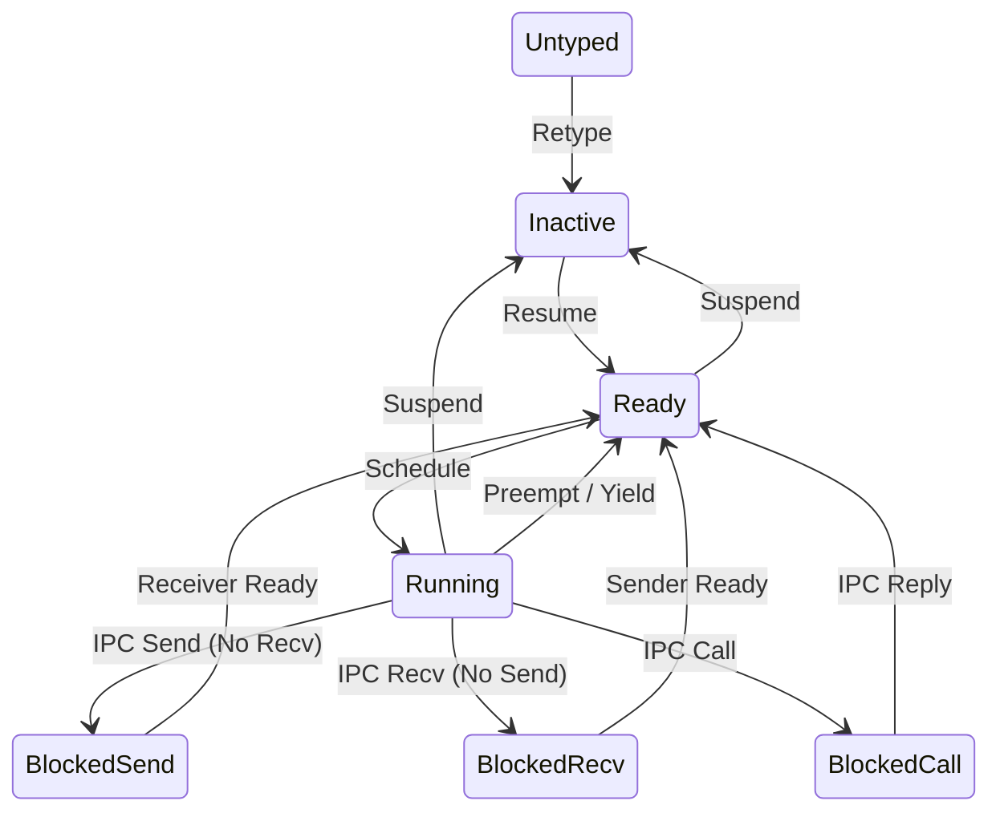

# 进程管理设计

## 1. 概述

在 Glenda 的微内核架构中，“进程”的概念被分解为正交的内核对象，以确保策略与机制的分离。内核管理 **线程**（执行单元），而 **地址空间** (VSpace) 和 **Capability 空间** (CSpace) 是线程使用的资源。

代表执行线程的核心内核对象是 **TCB (线程控制块)**。此抽象用于用户空间进程和内部内核任务（例如 Idle 线程、中断处理程序）。

## 2. 线程生命周期

Glenda 中的线程处于几种严格定义的状态之一。状态转换由系统调用 (IPC)、中断或显式 TCB capability 调用触发。

### 2.1 状态

| 状态 | 描述 |
| :--- | :--- |
| **Inactive** | TCB 已分配但尚未配置或已被显式挂起。它没有资格进行调度。 |
| **Ready** | 线程已准备好执行并存在于调度程序的运行队列中。 |
| **Running** | 线程当前正在 CPU 上执行。 |
| **BlockedSend** | 线程正在等待向繁忙的接收者发送 IPC 消息。 |
| **BlockedRecv** | 线程正在等待从端点接收 IPC 消息。 |
| **BlockedCall** | 线程正在等待 IPC Call 的回复。 |

### 2.2 状态转换图

## 3. 线程控制块 (TCB) 结构

TCB 是仅限内核的结构。它包含管理执行所需的最小状态。

### 3.1 核心字段

*   **Arch State**: 保存的 CPU 寄存器（PC, SP, 通用寄存器）。
*   **Priority**: 调度优先级 (0-255)。
*   **Time Slice**: 剩余时间片。
*   **State**: 当前生命周期状态 (枚举)。
*   **Intrusive Links**: `prev` 和 `next` 指针，用于将 TCB 链接到调度程序或 IPC 队列中，无需动态分配。
*   **IPC State**:
    *   `fault_handler`: 发送故障 IPC 的 Capability (Endpoint)。
    *   `ipc_buffer`: IPC 缓冲区的虚拟地址（UTCB 的一部分）。
    *   `send_queue_head/tail`: 等待发送到此线程的线程队列。
*   **CSpace Root**: 线程 capability 空间根 `CNode` 的 Capability。
*   **VSpace Root**: 线程地址空间根 `PageTable` 的 Capability。
*   **UTCB Frame**: 用于 UTCB 的物理帧的 Capability。
*   **UTCB Pointer**: 线程地址空间中用户线程控制块的虚拟地址。
*   **Fault Handler**: 发送故障 IPC 的 Capability (Endpoint)。

### 3.2 用户线程控制块 (UTCB)

UTCB 是内核和用户线程之间共享的一页内存。它被映射到用户的 VSpace 中。

*   **目的**:
    *   **IPC 消息寄存器**: 存储超过 CPU 寄存器的 IPC 负载。
    *   **TLS**: 线程本地存储指针。
    *   **IPC 缓冲区**: 接收 capabilities 的目的地。
*   **访问**:
    *   **用户**: 读/写。
    *   **内核**: 读/写（在 IPC 和线程设置期间）。

## 4. 生命周期操作

### 4.1 创建

线程创建是用户空间的责任（通常由 root task 或进程管理器执行），涉及多个内核步骤：

1.  **分配**: 父线程调用 `Untyped` capability 将一部分内存 **Retype** 为新的 `TCB` 对象。
2.  **地址空间设置**: 父线程为 TCB 分配 VSpace (PageTable cap)。
3.  **Capability 空间设置**: 父线程为 TCB 分配 CSpace (CNode cap)。
4.  **UTCB 设置**: 父线程分配一个帧作为 UTCB 并将其映射到新线程的 VSpace 中。
5.  **配置**: 父线程调用 `TCB` capability 以绑定 CSpace, VSpace, UTCB 帧和 UTCB 虚拟地址。它还设置初始指令指针 (IP)、栈指针 (SP) 和优先级。
6.  **激活**: 父线程调用 `TCB::Resume()`，将线程从 **Inactive** 转换为 **Ready**。

### 4.2 执行与调度

*   **算法**: 抢占式优先级轮转。
*   **策略**:
    *   始终运行最高优先级的 **Ready** 线程。
    *   如果多个线程具有相同的最高优先级，则在它们之间轮转。
*   **抢占**: 当更高优先级的线程变为 Ready（例如，通过中断或 IPC 解除阻塞）或当前线程的时间片耗尽时发生。

### 4.3 故障处理

当线程导致故障（例如，缺页异常、非法指令、除以零）时：

1.  内核挂起该线程。
2.  内核构造描述故障的 IPC 消息。
3.  内核将此消息发送到线程注册的 **Fault Handler** (Endpoint capability)。
4.  线程进入 **BlockedSend** 状态（等待处理程序回复）。
5.  Fault Handler（外部监视器/调试器）接收消息，决定如何处理（例如，杀死线程、修复映射、重启），并回复。
6.  回复解除线程阻塞（或修改其状态）。

### 4.4 终止

线程不会以传统意义上的“退出”；它们只是停止运行或被销毁。

*   **自愿退出**: 线程可以在其自己的 TCB cap 上调用方法来挂起自己，或向其管理器发送消息请求销毁。
*   **非自愿终止**: 持有 TCB capability 的管理器可以调用 `TCB::Suspend()` 或简单地 **Revoke** TCB capability。
*   **资源回收**:
    *   当 TCB 被销毁时（通过在创建它的 Untyped 内存上调用 `Revoke`），内核确保将其从调度程序队列中移除。
    *   线程 CSpace 中持有的 Capabilities *不会* 自动销毁，除非 CNode 本身被销毁。
    *   VSpace *不会* 自动销毁；它只是被分离。

### 4.5 内核线程与上下文切换

Glenda 将内核任务视为设置了 `privileged` 标志的特殊 TCB。

#### 4.5.1 内核 TCB 特征
*   **特权级别**: 始终在 S-Mode 下执行。
*   **地址空间**: 通常共享内核的全局页表。
*   **栈**: 使用专用的内核栈。
*   **CSpace**: 可能具有受限或空的 CSpace，因为它以内核权限运行。

#### 4.5.2 切换逻辑
调度程序根据目标 TCB 的 `privileged` 标志执行上下文切换：

1.  **User -> User**:
    *   保存当前 U-Mode 寄存器到当前 TCB。
    *   切换 `satp` 到目标 VSpace。
    *   恢复目标 U-Mode 寄存器。
    *   `sret` 到 U-Mode。
2.  **User -> Kernel**:
    *   发生 Trap (系统调用/中断)。
    *   保存 U-Mode 状态到当前 TCB。
    *   切换到目标内核 TCB 栈。
    *   恢复内核 TCB 寄存器。
    *   在 S-Mode 下继续执行。
3.  **Kernel -> User**:
    *   保存内核 TCB 状态。
    *   切换 `satp` 到目标 VSpace。
    *   恢复目标 U-Mode 状态。
    *   `sret` 到 U-Mode。
4.  **Kernel -> Kernel**:
    *   直接保存/恢复 S-Mode 寄存器（被调用者保存）并切换栈。如果它们共享内核地址空间，则无需切换 `satp`。

## 5. Capability 接口

`TCB` 内核对象通过 `syscall_invoke` 暴露以下方法：

| 方法 | 描述 |
| :--- | :--- |
| `Configure` | 设置 CSpace 根, VSpace 根, UTCB 地址和 Fault Handler。 |
| `SetPriority` | 更改调度优先级。 |
| `SetRegisters` | 写入线程保存的寄存器状态 (IP, SP 等)。 |
| `GetRegisters` | 读取线程保存的寄存器状态。 |
| `Resume` | 从 **Inactive** 转换为 **Ready**。 |
| `Suspend` | 从任何状态转换为 **Inactive**。 |

## 6. 未来工作: SMP 支持

*   **亲和性**: TCB 将需要 CPU 亲和性字段。
*   **迁移**: 在每 CPU 运行队列之间移动 TCB 的机制。
*   **IPI**: 处理器间中断，以触发其他核心上的重新调度。
