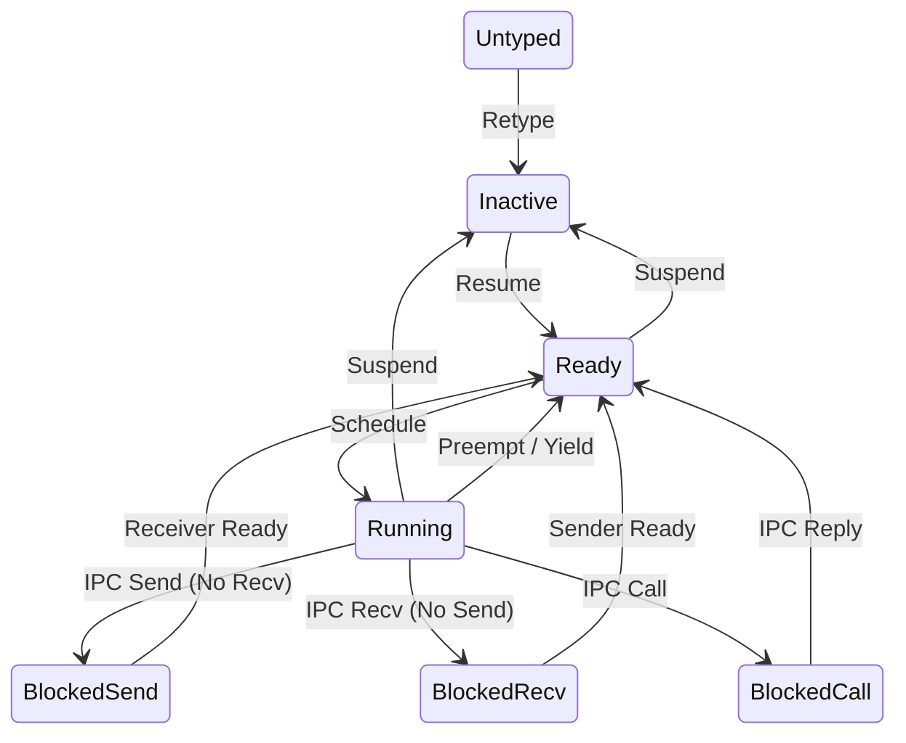

# 进程管理设计

## 1. 概述

在 Glenda 的微内核架构中，“进程”的概念被分解为正交的内核对象，以确保策略与机制的分离。内核管理 **线程**（执行单元），而 **地址空间** (VSpace) 和 **Capability 空间** (CSpace) 是线程使用的资源。

代表执行线程的核心内核对象是 **TCB (线程控制块)**。此抽象用于用户空间进程和内部内核任务（例如 Idle 线程、中断处理程序）。

## 2. 线程生命周期

Glenda 中的线程处于几种严格定义的状态之一。状态转换由系统调用 (IPC)、中断或显式 TCB capability 调用触发。

### 2.1 状态

| 状态 | 描述 |
| :--- | :--- |
| **Inactive** | TCB 已分配但尚未配置或已被显式挂起。它没有资格进行调度。 |
| **Ready** | 线程已准备好执行并存在于调度程序的运行队列中。 |
| **Running** | 线程当前正在 CPU 上执行。 |
| **BlockedSend** | 线程正在等待向繁忙的接收者发送 IPC 消息。 |
| **BlockedRecv** | 线程正在等待从端点接收 IPC 消息。 |
| **BlockedCall** | 线程正在等待 IPC Call 的回复。 |

### 2.2 状态转换图

```mermaid
stateDiagram-v2
    Untyped --> Inactive: Retype
    Inactive --> Ready: Resume
    Ready --> Inactive: Suspend
    Running --> Inactive: Suspend

    Ready --> Running: Schedule
    Running --> Ready: Preempt / Yield

    Running --> BlockedSend: IPC Send (No Recv)
    BlockedSend --> Ready: Receiver Ready

    Running --> BlockedRecv: IPC Recv (No Send)
    BlockedRecv --> Ready: Sender Ready

    Running --> BlockedCall: IPC Call
    BlockedCall --> Ready: IPC Reply
```

## 3. 线程控制块 (TCB) 结构

TCB 是仅限内核的结构。它包含管理执行所需的最小状态。

### 3.1 核心字段

*   **Arch State**: 保存的 CPU 寄存器（`pc`, `sp`, `a0`-`a7`, `s0`-`s11` 等）。在 `sys_invoke` 时保存。
*   **Priority**: 调度优先级 (0-255)。支持优先级继承。
*   **Time Slice**: 剩余时间片。
*   **Affinity**: 指定线程绑定的 CPU 核心 ID。
*   **State**: 当前生命周期状态 (Ready, Running, Blocked 等)。
*   **Intrusive Links**: 内部 `prev`/`next` 指针，实现零分配的任务队列。
*   **IPC State**: 关联的 `ipc_partner` 和 `badge`。

### 3.2 用户线程控制块 (UTCB)

UTCB 在内核侧通过 `tcb.utcb_frame` 进行管理。

*   **映射**：每个 TCB 都有一个 `utcb_pointer` (通常指向 `UTCB_VA`)。
*   **上下文共享**：内核可以直接读写 UTCB 中的 `msg_tag` 和 `mrs_regs`。

## 4. 调度算法

内核实现了一个 **多级反馈队列 (MLFQ)** 或简单的 **优先级轮转 (Priority Round Robin)** 调度器（在 `kernel/src/proc/scheduler.rs` 实现）：

*   **Ready Queues**: 每个优先级对应一个链表。
*   **抢占机制**：内核时钟中断周期性减少 `timeslice`。耗尽后任务移至队列末尾。
*   **时间片捐赠**：在 `Call` IPC 时，发送者将剩余时间片“借给”接收者。

## 5. 故障处理 (Fault Handling)

当线程触发异常（缺页、非法指令、断点）时，内核会捕获并生成一条特殊的 IPC 消息发送到 TCB 配置的 `fault_handler`。
*   **协议**：使用 `KERNEL_PROTO` (0x2)。
*   **标签**：`PAGE_FAULT`, `ILLEGAL_INSTRUCTION` 等。
*   **处理者**：通常是 `Warren` 或调试器。处理者可以修改 TCB 状态或通过 `Reply` 恢复执行。

当线程导致故障（例如，缺页异常、非法指令、除以零）时：

1.  内核挂起该线程。
2.  内核构造描述故障的 IPC 消息。
3.  内核将此消息发送到线程注册的 **Fault Handler** (Endpoint capability)。
4.  线程进入 **BlockedSend** 状态（等待处理程序回复）。
5.  Fault Handler（外部监视器/调试器）接收消息，决定如何处理（例如，杀死线程、修复映射、重启），并回复。
6.  回复解除线程阻塞（或修改其状态）。

### 4.4 终止

线程不会以传统意义上的“退出”；它们只是停止运行或被销毁。

*   **自愿退出**: 线程可以在其自己的 TCB cap 上调用方法来挂起自己，或向其管理器发送消息请求销毁。
*   **非自愿终止**: 持有 TCB capability 的管理器可以调用 `TCB::Suspend()` 或简单地 **Revoke** TCB capability。
*   **资源回收**:
    *   当 TCB 被销毁时（通过在创建它的 Untyped 内存上调用 `Revoke`），内核确保将其从调度程序队列中移除。
    *   线程 CSpace 中持有的 Capabilities *不会* 自动销毁，除非 CNode 本身被销毁。
    *   VSpace *不会* 自动销毁；它只是被分离。

### 4.5 内核线程与上下文切换

Glenda 将内核任务视为设置了 `privileged` 标志的特殊 TCB。

#### 4.5.1 内核 TCB 特征
*   **特权级别**: 始终在 S-Mode 下执行。
*   **地址空间**: 通常共享内核的全局页表。
*   **栈**: 使用专用的内核栈。
*   **CSpace**: 可能具有受限或空的 CSpace，因为它以内核权限运行。

#### 4.5.2 切换逻辑
调度程序根据目标 TCB 的 `privileged` 标志执行上下文切换：

1.  **User -> User**:
    *   保存当前 U-Mode 寄存器到当前 TCB。
    *   切换 `satp` 到目标 VSpace。
    *   恢复目标 U-Mode 寄存器。
    *   `sret` 到 U-Mode。
2.  **User -> Kernel**:
    *   发生 Trap (系统调用/中断)。
    *   保存 U-Mode 状态到当前 TCB。
    *   切换到目标内核 TCB 栈。
    *   恢复内核 TCB 寄存器。
    *   在 S-Mode 下继续执行。
3.  **Kernel -> User**:
    *   保存内核 TCB 状态。
    *   切换 `satp` 到目标 VSpace。
    *   恢复目标 U-Mode 状态。
    *   `sret` 到 U-Mode。
4.  **Kernel -> Kernel**:
    *   直接保存/恢复 S-Mode 寄存器（被调用者保存）并切换栈。如果它们共享内核地址空间，则无需切换 `satp`。

## 5. Capability 接口

`TCB` 内核对象通过 `syscall_invoke` 暴露以下方法：

| 方法 | 描述 |
| :--- | :--- |
| `Configure` | 设置 CSpace 根, VSpace 根, UTCB 地址和 Fault Handler。 |
| `SetPriority` | 更改调度优先级。 |
| `SetRegisters` | 写入线程保存的寄存器状态 (IP, SP 等)。 |
| `GetRegisters` | 读取线程保存的寄存器状态。 |
| `Resume` | 从 **Inactive** 转换为 **Ready**。 |
| `Suspend` | 从任何状态转换为 **Inactive**。 |

## 6. 未来工作: SMP 支持

*   **亲和性**: TCB 将需要 CPU 亲和性字段。
*   **迁移**: 在每 CPU 运行队列之间移动 TCB 的机制。
*   **IPI**: 处理器间中断，以触发其他核心上的重新调度。
